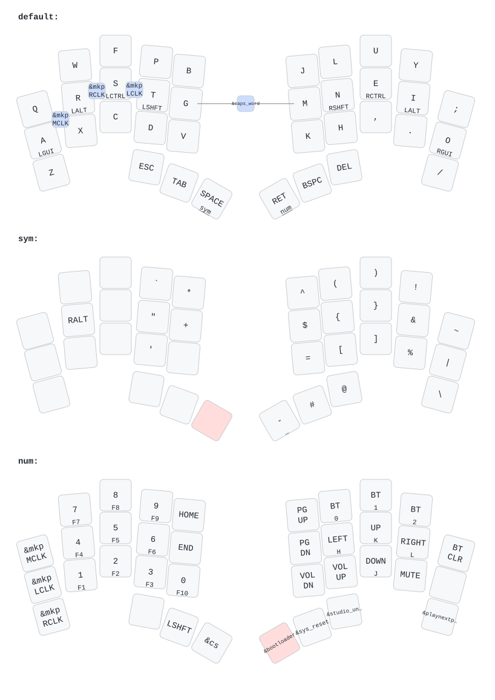

# Документація оновленої прошивки Keiler-trackpad

Цей документ описує поточну прошивку для спліт-клавіатури **Keiler** з контролерами **SuperMini nRF52840** та інтегрованим трекпадом **Cirque Pinnacle** на правій половинці.

Збірка використовує ZMK board target `nice_nano//zmk`, оскільки SuperMini nRF52840 сумісний з nice!nano v2 за pinout/bootloader моделлю, а сучасний ZMK після переходу на Zephyr 4.1 вимагає явний `//zmk` board variant.

---

## ⌨️ Поточна розкладка та шари

Прошивка має 3 основні шари:

### 1. Базовий шар `default`
* Основна розкладка: `Q W F P B / J L U Y ;`, `A R S T G / M N E I O`, `Z X C D V / K H , . /`.
* Home Row Mods на базовому шарі:
  * `A` утриманням дає `LGUI`.
  * `R` утриманням дає `LALT`.
  * `S` утриманням дає `LCTRL`.
  * `T` утриманням дає `LSHFT`.
  * `N` утриманням дає `RSHFT`.
  * `E` утриманням дає `RCTRL`.
  * `I` утриманням дає `LALT`.
  * `O` утриманням дає `RGUI`.
* Великі пальці:
  * `Esc`, `Tab`
  * `Space` / утримання `SYM`
  * `Return` / утримання `NUM`
  * `Backspace`, `Delete`

### 2. Шар `SYM`
Шар символів активується утриманням `Space`:
* Основні символи: `` ` ``, `*`, `^`, `(`, `)`, `!`, `~`, `"`, `+`, `$`, `{`, `}`, `&`, `|`, `'`, `=`, `[`, `]`, `%`, `\`, `#`, `@`.
* `RALT` доступний на лівій руці.
* Клавіша `-` має dual-role поведінку через `mp`: tap = `-`, hold = `_`.
* На цьому ж шарі рух трекпадом перемикається з курсора на scroll mode.

### 3. Шар `NUM`
Шар цифр, навігації, Bluetooth і сервісних команд активується утриманням `Return`:
* Ліва рука:
  * `MCLK`, `LCLK`, `RCLK` для фізичних кліків миші.
  * Цифри `1-9`, `0` із F-клавішами на hold: `F1-F10`.
  * `Home`, `End`, `LShift`, `cs`.
* Права рука:
  * `Page Up`, `Page Down`, стрілки `Left/Up/Right/Down`.
  * `BT_SEL 0`, `BT_SEL 1`, `BT_SEL 2`, `BT_CLR`.
  * `C_VOL_DN`, `C_VOL_UP`, `C_MUTE`, `playnextprev`.
  * `Bootloader`, `Sys Reset`, `Studio Unlock`.

### 4. Combo та спеціальні поведінки
* **`G + M`** → `caps_word`.
* **`S + T`** → `LCLK`.
* **`R + S`** → `RCLK`.
* **`A + R`** → `MCLK`.
* `ht` — home-row hold-tap з `quick-tap-ms = <175>` для зменшення хибних модифікаторів під час швидкого друку.
* `lp` — layer/tap behavior для великих пальців: hold відкриває шар, tap надсилає звичайну клавішу.
* `mp` — dual-role key behavior для символів і цифр, зокрема `-/_` та `1/F1` ... `0/F10`.
* `cs` — tap-dance:
  * 1 натискання → `LCTRL`.
  * 2 швидких натискання → `LC(LSHFT)`.
* `playnextprev` — tap-dance для медіа:
  * 1 натискання → Play / Pause.
  * 2 швидких натискання → Next.
  * 3 швидких натискання → Previous.

Актуальна візуальна карта розкладки зберігається у [keymap-drawer/Keiler.svg](./keymap-drawer/Keiler.svg), а її YAML-джерело — у [keymap-drawer/Keiler.yaml](./keymap-drawer/Keiler.yaml).



---

## 🎛️ Жести та керування мишею (Pointing & Gestures)

### 1. Режим прокручування (Scroll Mode)
* **Як активувати**: Затисніть клавішу **`SYM`** на лівому великому пальці (перехід на шар символів).
* **Поведінка**: Будь-яке переміщення пальця по трекпаду замість руху курсора виконує плавне вертикальне та горизонтальне прокручування екрана.
* **Налаштування**:
  * Реалізовано через ZMK `input-listener` у файлі [Keiler_left.overlay](./config/boards/shields/Keiler/Keiler_left.overlay).
  * Використовує вбудований перетворювач координат `&zip_xy_to_scroll_mapper` та масштабувальник `&zip_scroll_scaler 1 3`.

### 2. Плавне прокручування (Smooth Scrolling)
* Активовано апаратну субпіксельну HID-прокрутку (`CONFIG_ZMK_POINTING_SMOOTH_SCROLLING=y`), завдяки чому скролінг у сучасних ОС відчувається плавно й без ривків.

### 3. Cirque Pinnacle на правій половинці
* Трекпад працює як ZMK split input device: правий контролер читає Cirque по I2C, передає input-події на лівий central, а лівий контролер віддає HID mouse report хосту.
* На SuperMini/nice!nano трекпад налаштовано через `&i2c1`, а `&spi1` вимкнено, щоб уникнути конфлікту периферії nRF52840.
* Для стабільного старту Pinnacle driver затримано через `CONFIG_INPUT_INIT_PRIORITY=99`.
* Поточні робочі параметри Cirque:
  * `data-mode = "relative"`
  * `sensitivity = "2x"`
  * `primary-tap-enable;`
  * `invert-y`
  * `data-ready-gpios = <&gpio1 2 GPIO_ACTIVE_HIGH>`

### 4. Параметри трекпада, які можна міняти
Основні параметри самого Cirque Pinnacle налаштовуються у вузлі `glidepoint0` у файлі [Keiler_right.overlay](./config/boards/shields/Keiler/Keiler_right.overlay):
* `sensitivity = "1x" | "2x" | "3x" | "4x"` — апаратна чутливість сенсора. `1x` найчутливіше, `4x` найменш чутливе. Поточне значення: `2x`.
* `data-mode = "relative" | "absolute"` — режим даних. Для звичайної миші використовується `relative`; `absolute` потрібен для сценаріїв із прямими координатами.
* `invert-x;` / `invert-y;` — інвертує відповідну вісь. Зараз увімкнено `invert-y;`.
* `swap-xy;` — міняє осі X та Y місцями, якщо трекпад фізично повернутий.
* `primary-tap-enable;` — вмикає tap-to-click у `relative` режимі.
* `sleep-mode-enable;` — дозволяє сенсору переходити в нижче енергоспоживання після бездіяльності.
* `idle-packets-count = <0..255>;` — кількість порожніх пакетів після зникнення дотику; зазвичай корисно для логіки tap detection.
* Для `absolute` режиму також доступні `clipping-enable;`, `active-range-x-min/max`, `active-range-y-min/max`, `scaling-enable;`, `scaling-x-resolution` та `scaling-y-resolution`.

Поведінка курсора й скролу після отримання подій налаштовується на лівій половинці у [Keiler_left.overlay](./config/boards/shields/Keiler/Keiler_left.overlay):
* `layers = <1>;` — шар, на якому активується scroll mode.
* `&zip_xy_to_scroll_mapper` — перетворює рух X/Y у горизонтальний/вертикальний скрол.
* `&zip_scroll_scaler 1 3` — масштабує швидкість скролу. Менший дільник робить скрол швидшим, більший дільник повільнішим.
* `&zip_xy_scaler <multiplier> <divisor>` — можна додати для зміни швидкості курсора, наприклад `&zip_xy_scaler 3 2` для швидшого руху.

### 5. Фізичні кліки на шарі `NUM`
Коли ви затискаєте праву клавішу великого пальця `Return` (шар цифр), вказівний, середній та безіменний пальці лівої руки отримують функції кліків миші (права рука позиціонує курсор трекпадом, ліва клікає):
* **Верхній ряд (`Q`)**: `&mkp MCLK` — Середній клік (Middle Click / натискання на коліщатко).
* **Домашній ряд (`A`)**: `&mkp LCLK` — Лівий клік (Left Click).
* **Нижній ряд (`Z`)**: `&mkp RCLK` — Правий клік (Right Click).

### 6. Швидкі комбо-кліки на базовому шарі (без зміни шарів!)
Для блискавичної взаємодії з інтерфейсом додано комбінації клавіш на домашньому рядку лівої руки (Home Row):
* **`S + T`** $\rightarrow$ **Лівий клік** (`&mkp LCLK`).
* **`R + S`** $\rightarrow$ **Правий клік** (`&mkp RCLK`).
* **`A + R`** $\rightarrow$ **Середній клік** (`&mkp MCLK`).
* **Затримка (Timeout)**: 40 мс із захистом `require-prior-idle-ms = <150>` для уникнення хибних спрацьовувань під час звичайного друку.

Окремо на базовому шарі є combo **`G + M`** $\rightarrow$ `caps_word` із `timeout-ms = <75>` та `require-prior-idle-ms = <100>`.

### 7. Можливі додаткові жести трекпада
У ZMK для Cirque Pinnacle практичніше мислити не мультитач-жестами як на ноутбуці, а режимами вводу через `input-processors`, шари та mouse button events. Частина поведінки вже реалізована, решта нижче — кандидати для наступних ітерацій.

#### Поточна поведінка
* **Tap по трекпаду** $\rightarrow$ **Лівий клік**. Увімкнено через `primary-tap-enable;` у `glidepoint0`.
* **`SYM` + рух по трекпаду** $\rightarrow$ **Плавний вертикальний/горизонтальний scroll**. Реалізовано через `&zip_xy_to_scroll_mapper` та `&zip_scroll_scaler 1 3`.
* **`NUM` + клавіші лівої руки** $\rightarrow$ **Фізичні L/M/R clicks** без натискання на сам трекпад.

#### Кандидати для додавання
* **`NUM` + tap по трекпаду** $\rightarrow$ **Правий клік**. Зручно для контекстного меню: звичайний tap лишається left click, а tap із затиснутим `NUM` стає right click.
* **`SYM` + tap по трекпаду** $\rightarrow$ **Середній клік**. Корисно для відкриття посилань у новій вкладці або закриття вкладок.
* **Precision mode** — окремий шар або modifier, де рух курсора сповільнюється, наприклад через `&zip_xy_scaler 1 3`. Корисно для маленьких кнопок, графічних редакторів і точного drag.
* **Fast cursor mode** — окремий шар, де рух курсора прискорюється, наприклад через `&zip_xy_scaler 2 1`. Корисно для великих моніторів.
* **Drag mode** — клавіша утримує `LCLK`, а трекпад рухає об'єкт. Це надійніше, ніж реалізовувати tap-and-drag лише на трекпаді.
* **Auto mouse layer** — дотик або рух по трекпаду тимчасово вмикає mouse layer на 1-2 секунди через `&zip_temp_layer`, щоб під рукою одразу були кліки, scroll або drag.
* **Окремі режими scroll direction/speed** — наприклад, `SYM` для звичайного scroll, `NUM` для повільного scroll або horizontal-heavy режиму.

Найбільш корисні кандидати для першого тесту: `NUM + tap = right click`, `SYM + tap = middle click` і `precision mode`.

---

## 🔋 Енергоефективність та Стабільність зв'язку

### 1. Глибокий сон (Deep Sleep)
* Клавіатура автоматично вимикає радіомодулі та переходить у режим ультранизького споживання енергії після **15 хвилин бездії** (`900000` мс).
* Пробудження відбувається миттєво після натискання будь-якої клавіші.
* `wakeup-source;` додано в `kscan` обох половинок, щоб клавіші могли будити контролери зі сну.

### 2. Збереження Bluetooth bond після фізичного вимикача
* Обидві половинки явно вмикають persistent settings storage: `CONFIG_SETTINGS`, `CONFIG_BT_SETTINGS`, `CONFIG_FLASH`, `CONFIG_FLASH_PAGE_LAYOUT`, `CONFIG_NVS`, `CONFIG_SETTINGS_NVS`.
* `CONFIG_ZMK_SETTINGS_SAVE_DEBOUNCE=5000` зменшує затримку запису налаштувань у flash до 5 секунд, щоб pairing/profile встигали зберегтися перед вимкненням живлення фізичним тумблером.
* Режими, що стирають bonds на старті, явно вимкнені:
  * `# CONFIG_ZMK_BLE_CLEAR_BONDS_ON_START is not set`
  * `# CONFIG_ZMK_SETTINGS_RESET_ON_START is not set`

### 3. Експериментальні BLE-покращення ZMK
* Увімкнено `CONFIG_ZMK_BLE_EXPERIMENTAL_CONN=y`, щоб використовувати новіші BLE-покращення ZMK/Zephyr для стабільності з'єднання.

### 4. Посилений сигнал Bluetooth (`+8 dBm TX Power`)
* Потужність Bluetooth-радіомодуля nRF52840 підвищено з базових 0 dBm до **`+8 dBm`** (`CONFIG_BT_CTLR_TX_PWR_PLUS_8=y`).
* **Результат**: покращує стабільність зв'язку між половинками та хостом у шумному 2.4 ГГц середовищі.

---

## 🎧 Керування мультимедіа та Bluetooth-профілями

### 1. Керування підключеннями
На шарі `NUM` додано можливість оперативного перемикання між 3 пристроями та очищення пам'яті:
* **`BT_SEL 0`** — Підключення до 1-го пристрою (ноутбук).
* **`BT_SEL 1`** — Підключення до 2-го пристрою (телефон).
* **`BT_SEL 2`** — Підключення до 3-го пристрою.
* **`BT_CLR`** — Очищення поточного профілю зв'язку.

### 2. Звук та Відтворення
На шарі `NUM` додано клавіші регулювання гучності:
* `C_VOL_DN` / `C_VOL_UP` — тихіше / голосніше.
* `C_MUTE` — вимкнути звук.
* **Розумний Tap-Dance (`playnextprev`)**:
  * **1 натискання** $\rightarrow$ Play / Pause.
  * **2 швидких натискання** $\rightarrow$ Наступний трек (Next).
  * **3 швидких натискання** $\rightarrow$ Попередній трек (Previous).

---

## 🛠️ Ергономіка та Обслуговування

### 1. Захист від хибних спрацьовувань Home Row Mods
* В поведінку `hold-tap` (`ht`) додано параметр `quick-tap-ms = <175>`. При швидкому друку подвійне натискання літери не перетвориться випадково на гарячу клавішу (Cmd/Ctrl/Alt).
* `require-prior-idle-ms = <150>` додатково зменшує випадкові спрацювання hold на home-row mods під час безперервного набору.
* Для layer/tap клавіш великих пальців використовується окремий behavior `lp` із `hold-preferred`, щоб утримання `Space`/`Return` надійно відкривало `SYM`/`NUM`.
* Для цифр/F-клавіш і `-/_` використовується окремий behavior `mp` із `tap-preferred`.

### 2. Сервісні команди (Правий великий палець на `NUM`)
* **`Bootloader`** — Переводить плату в режим USB-накопичувача для прошивки `.uf2` файлом без розбирання корпусу клавіатури.
* **`Sys Reset`** — Перезавантажує контролер.
* **`Studio Unlock`** — Розблоковує підключення до веб-конфігуратора **ZMK Studio**.
* Для лівої половинки в `build.yaml` додано snippet `studio-rpc-usb-uart`, щоб ZMK Studio міг працювати через USB/UART RPC.

---

## 🧩 Робота з ZMK Studio

ZMK Studio дозволяє змінювати розкладку через графічний інтерфейс без редагування `.keymap` і без повної перепрошивки після кожної зміни.

### Що вже увімкнено в цій прошивці
* `CONFIG_ZMK_STUDIO=y` увімкнено для прошивки.
* Для лівої половинки в [build.yaml](./build.yaml) додано `snippet: studio-rpc-usb-uart`.
* На шарі `NUM` є клавіша `Studio Unlock` (`&studio_unlock`) на правому великому пальці.
* Ліва половинка є central (`CONFIG_ZMK_SPLIT_ROLE_CENTRAL=y`), тому саме її треба підключати до комп'ютера для роботи зі Studio через USB.

### Як підключитися
1. Підключіть **ліву половинку** Keiler до комп'ютера через USB.
2. Переконайтеся, що клавіатура працює саме через USB endpoint. Якщо одночасно активні USB і Bluetooth, ZMK Studio найнадійніше працює, коли output вибраний на той самий endpoint, через який ви підключаєтесь.
3. Відкрийте ZMK Studio у Chrome/Edge або в нативному застосунку ZMK Studio.
4. Натисніть на клавіатурі `NUM` + `Studio Unlock`.
5. У ZMK Studio виберіть Keiler зі списку пристроїв і дозвольте доступ до USB serial/Web Serial порту.
6. Змініть потрібні key bindings або layer names у UI.
7. Збережіть зміни в ZMK Studio. Зміни записуються в налаштування клавіатури, а не в `config/Keiler.keymap`.

### Що можна міняти через Studio
* Призначення клавіш на уже наявних шарах.
* Назви шарів.
* Увімкнення/використання уже описаних у прошивці behaviors.
* Імпорт/експорт keymap зі Studio.

### Обмеження
* Studio не додає нові behaviors, яких немає в devicetree/keymap прошивки.
* Studio не додає нові фізичні layouts.
* Якщо почати керувати розкладкою через Studio, подальші зміни в [config/Keiler.keymap](./config/Keiler.keymap) можуть не застосовуватися до клавіатури, доки в ZMK Studio не виконати **Restore Stock Settings**.
* Після **Restore Stock Settings** клавіатура повертається до stock keymap із прошивки, тобто до того, що зібрано з репозиторію.
* Якщо треба змінити низькорівневі речі на кшталт `input-processors`, scroll mode, Cirque parameters, combo definitions або нові custom behaviors, це треба робити в репозиторії й перепрошивати клавіатуру.

### Практичний робочий процес
* Для швидкого експерименту з перестановкою клавіш використовуйте ZMK Studio.
* Коли фінальна розкладка визначена, перенесіть важливі зміни назад у [config/Keiler.keymap](./config/Keiler.keymap), виконайте commit/push і зберіть прошивку.
* Якщо після цього клавіатура продовжує показувати стару Studio-версію розкладки, відкрийте ZMK Studio та виконайте **Restore Stock Settings**.

### Типові проблеми
* **Studio не бачить клавіатуру**: перевірте, що підключена ліва половинка, прошивка зібрана зі `studio-rpc-usb-uart`, і натиснуто `NUM` + `Studio Unlock`.
* **Немає доступу до serial port**: на Linux може знадобитися додати користувача до групи доступу до serial-портів, наприклад `dialout` або `uucp`, залежно від дистрибутива.
* **Зміни в `.keymap` не видно після перепрошивки**: найімовірніше, активні налаштування Studio збережені у flash. Виконайте **Restore Stock Settings** у ZMK Studio.

---

## 🖼️ Автоматична карта розкладки (keymap-drawer)

У репозиторії є окремий GitHub Actions workflow [draw-keymaps.yml](./.github/workflows/draw-keymaps.yml), який автоматично оновлює візуальну карту розкладки після push.

Workflow запускається при змінах у:
* `config/*.keymap`
* `config/*.dtsi`
* `config/*.json`
* `.github/workflows/draw-keymaps.yml`

Що робить workflow:
1. Встановлює `keymap-drawer==0.18.1`.
2. Парсить [config/Keiler.keymap](./config/Keiler.keymap) з `-c 10`.
3. Додає layout-опис із [config/Keiler.json](./config/Keiler.json).
4. Перегенеровує:
   * [keymap-drawer/Keiler.yaml](./keymap-drawer/Keiler.yaml)
   * [keymap-drawer/Keiler.svg](./keymap-drawer/Keiler.svg)
5. Якщо файли змінилися, комітить їх назад у репозиторій як `chore: update keymap drawer`.

Локально карту можна перегенерувати так:
```bash
keymap parse -z config/Keiler.keymap -c 10 -o /tmp/Keiler.yaml
{
  echo "layout: {qmk_info_json: config/Keiler.json, qmk_layout: LAYOUT}"
  cat /tmp/Keiler.yaml
} > keymap-drawer/Keiler.yaml
keymap draw keymap-drawer/Keiler.yaml -o keymap-drawer/Keiler.svg
```

---

## 📝 Як оновити прошивку на клавіатурі
1. Переконайтеся, що [build.yaml](./build.yaml) використовує `nice_nano//zmk` для `Keiler_left`, `Keiler_right` і `settings_reset`.
2. Надішліть зміни на свій GitHub-репозиторій:
   ```bash
   git add .
   git commit -m "docs: update Keiler trackpad firmware notes"
   git push
   ```
3. Після push автоматично запустяться:
   * основний ZMK build workflow;
   * keymap-drawer workflow, якщо змінювалися файли розкладки або геометрії.
4. Перейдіть у вкладку **Actions** вашого GitHub-репозиторію та дочекайтеся завершення збірки.
5. Скачайте архів із прошивкою.
6. За потреби один раз прошийте `settings_reset`, щоб очистити старі bonds/settings.
7. Обов'язково після `settings_reset` прошийте нормальні `Keiler_left` та `Keiler_right`.
8. Забудьте клавіатуру на ноуті, спарте заново, зачекайте 10-15 секунд, потім перевірте вимкнення/увімкнення фізичним перемикачем.

---

## 🔎 Перевірка після збірки
У build log для лівої половинки мають бути:
```conf
CONFIG_ZMK_SPLIT_ROLE_CENTRAL=y
CONFIG_ZMK_MOUSE=y
CONFIG_ZMK_BLE_EXPERIMENTAL_CONN=y
CONFIG_ZMK_SETTINGS_SAVE_DEBOUNCE=5000
CONFIG_BT_CTLR_TX_PWR_PLUS_8=y
CONFIG_ZMK_STUDIO=y
```

У build log для правої половинки мають бути:
```conf
CONFIG_INPUT_PINNACLE=y
CONFIG_INPUT_INIT_PRIORITY=99
CONFIG_NRFX_TWIM1=y
CONFIG_ZMK_INPUT_SPLIT=y
CONFIG_ZMK_BLE_EXPERIMENTAL_CONN=y
CONFIG_ZMK_SETTINGS_SAVE_DEBOUNCE=5000
CONFIG_BT_CTLR_TX_PWR_PLUS_8=y
```
